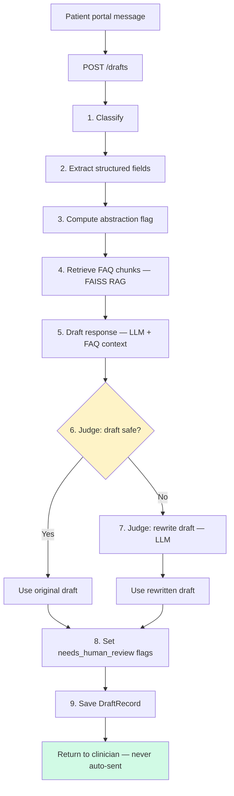

# Project overview — dermatology triage prototype


**Use case:** Triage patient portal messages for a dermatology clinic, prepare clinician drafts (never auto-send), and measure trust via an eval harness.

Related docs:
- [`INSTRUCTIONS.md`](../INSTRUCTIONS.md) — setup and run commands
- [`docs/eval_dataset_methodology.md`](eval_dataset_methodology.md) — gold dataset and eval runbook
- [`docs/eval_decisions.md`](eval_decisions.md) — eval-specific ADRs
- [`data/labeling_protocol.md`](../data/labeling_protocol.md) — label rules

---

## What is done

### Triage service (FastAPI)

The API and pipeline are **async** (`async def` endpoints, `await pipeline.run(...)`). Each pipeline step that calls an LLM or embedding API is non-blocking, so while one request waits on network I/O the event loop can serve other requests.

**Endpoints** (`service/main.py`): `POST /drafts` — accept a patient message, run the pipeline, return a `DraftRecord`; `GET /drafts/{draft_id}` — fetch a previously saved draft. (`GET /health` is also exposed for liveness checks.)

In a busy clinic portal many messages can arrive at once. Async I/O lets the server **process multiple drafts concurrently** without dedicating one thread per message — important when each request triggers several LLM calls (classify, extract, draft, judge). Steps within a single message still run **in order** (see workflow below); concurrency is across messages.

| Capability | Implementation |
|---|---|
| Four-class triage | `Classification` enum + LLM/dummy classifiers — `service/models.py`, `service/steps/llm_classifier.py`, `service/steps/classifier.py` |
| Structured field extraction | Pydantic `StructuredFields` via LLM structured output — `service/models.py`, `service/steps/llm_extractor.py` |
| Draft response generation | Per-task LLM or dummy template — `service/steps/llm_drafter.py`, `service/steps/drafter.py` |
| KB (knowledge base) | FAISS retrieve at draft time — `service/kb/`, `service/pipeline.py` |
| Two-step LLM judge | Check then rewrite — `service/steps/llm_judge.py`, `service/steps/prompts.py` |
| Human-review flags | Set from triage + judge rewrite — `service/pipeline.py`, `service/models.py` |
| Draft persistence | In-memory store on `POST`/`GET /drafts` — `service/store/memory.py`, `service/main.py` |
| Versioned prompts | `PROMPT_VERSION` + step prompts — `service/steps/prompts.py` |

### Evaluation harness

| Capability | Implementation |
|---|---|
| Labeled gold set (75 examples) | Merged JSONL — `data/eval/labeled.jsonl`, `eval/data/build_dataset.py` |
| ChatDoctor harvest + dual-model labeling + adjudication | Harvest, label, merge pipeline — `eval/data/harvest_chatdoctor.py`, `eval/data/label_candidates.py` |
| Classify-only metrics (P/R/F1, confusion matrix) | Sklearn metrics over predictions — `eval/metrics.py`, `eval/runner.py` |
| EMERGENT recall as headline metric | Primary safety metric in reports — `eval/metrics.py`, `eval/report.py` |
| One-command eval | CLI entry point — `eval/run.py` |
| API smoke test mode | HTTP round-trip checks — `eval/run.py` (`--mode api`), `eval/api_smoke.py` |
| Full-pipeline eval, ablations, draft-quality eval | Not implemented |

---

## Workflow

### Single message (sequential steps)

Each `POST /drafts` runs the pipeline below. LLM steps are awaited one after another; FAQ retrieval and abstraction run in the same request flow.



| Step | What it does | Output |
|------|----------------|--------|
| 1. Classify | Triage into `emergent` / `urgent` / `routine` / `admin` | `classifications` |
| 2. Extract | Pull symptoms, duration, location, severity, onset | `structured_fields` |
| 3. Abstraction | Flag high-priority cases for review | `abstraction_flag` |
| 4. RAG retrieve | Top-k FAQ chunks from `dermatology_faq.txt` | `retrieved_sources` |
| 5. Draft | Generate clinician draft grounded in FAQ | draft text |
| 6–7. Judge | Check safety; rewrite if diagnosis/treatment advice detected | `judge_result`, final draft |
| 8–9. Persist | Apply review flags, store and return | `DraftRecord` |

Messages are **never sent to patients**. Clinicians review drafts; `needs_human_review` is set for emergent/urgent triage or when the judge rewrites a draft.

---

## Project structure

```
temp_checks/
├── service/                 # FastAPI app + pipeline
│   ├── main.py              # HTTP endpoints, app lifespan
│   ├── dependencies.py      # Startup: build FAISS index + pipeline
│   ├── pipeline.py          # Orchestrates all steps
│   ├── pipeline_factory.py  # Wires LLM/dummy steps from settings
│   ├── models.py            # API schemas (DraftRecord, etc.)
│   ├── settings.py          # .env → typed config
│   ├── steps/               # classify, extract, draft, judge
│   ├── kb/                  # FAQ chunking, embeddings, FAISS build/retrieve
│   ├── llm/                 # OpenAI client, structured output helper
│   └── store/               # In-memory draft store
├── eval/                    # Classification eval harness + dataset tooling
├── data/
│   ├── kb/dermatology_faq.txt   # Clinic FAQ for RAG
│   └── eval/                    # Gold set, labeling artifacts, fixtures
├── docs/                    # This file + eval methodology + ADRs
├── tests/                   # pytest (pipeline, kb, judge, eval, API)
├── INSTRUCTIONS.md          # How to run locally
```

---

## Key design decisions

### 1. Async FastAPI + async pipeline

Endpoints and `DraftPipeline.run()` are async so LLM and embedding calls do not block the server. Many portal messages can be handled concurrently on one process; each message still flows through the steps in order.

### 2. Step-based pipeline with dummy + OpenAI modes

Each step (`classify`, `extract`, `draft`, `judge`) has a **dummy** implementation for local/CI use and an **OpenAI** implementation controlled by `LLM_MODE`. This keeps tests fast and cheap while allowing real LLM runs with one env change.

### 3. FAQ RAG for draft grounding

Drafts use retrieved FAQ excerpts (`data/kb/dermatology_faq.txt`) so replies reuse **approved clinic language** instead of purely generated text. Retrieval runs on the patient message; top-k chunks are injected into the draft prompt. Retrieved chunk IDs and scores are returned in `retrieved_sources`.

**Prototype limitation (documented in code):** the FAISS index is **rebuilt on every app startup**. Production should persist the index and rebuild only when the FAQ file changes.

### 4. Two-step LLM judge

After drafting, an LLM **checks** the draft for unsafe content (diagnosis, med changes, definitive treatment). If rejected, a second LLM call **rewrites** it. The judge prompt defines violation codes (e.g. `diagnosis_statement`, `medication_change`). Rewrites set `needs_human_review=true` so clinicians still approve the corrected text.

Ideally the judge would use an LLM from a **different model family** than the drafter to reduce shared blind spots; that was not implemented here due to time limitations (judge and draft both use OpenAI today).

### 5. Eval calls the pipeline directly, not HTTP

Classification metrics invoke `build_classifier()` in-process. HTTP is used only for `--mode api` smoke tests. Rationale: faster, no server lifecycle in CI, metrics decoupled from API wiring.

### 6. Gold dataset: ChatDoctor + handcrafted + human adjudication

- **50** ChatDoctor inputs (derm-filtered, `input` only — never model `output` as labels)
- **25** handcrafted adversarial/ambiguous cases
- **Two labeler models** + human adjudication on disagreement
- **75** total rows; **EMERGENT recall** is the safety headline metric

Known gap: `admin` class has only **4** examples (target ≥8). ChatDoctor harvesting and dermatology keyword filtering skew the pool toward clinical messages; after triage-oriented curation, few pure admin-only portal messages remain. A **second curation round** (handwritten or sourced admin scheduling/billing/insurance messages) is needed to balance the set.

---

## Configuration (summary)

| Variable | Role |
|---|---|
| `LLM_MODE` | `dummy` (no API) or `openai` |
| `LLM_CLASSIFY_MODEL` | Triage classification |
| `LLM_EXTRACT_MODEL` | Structured extraction |
| `LLM_DRAFT_MODEL` | Draft generation |
| `LLM_JUDGE_MODEL` | Safety check + rewrite |
| `LLM_EMBED_MODEL` | FAQ embeddings (openai mode) |
| `KB_FAQ_PATH` | FAQ source file |
| `KB_TOP_K` | Chunks retrieved per message |

See [`.env.example`](../.env.example) for defaults.

---

## Future improvements

- **Multi-LLM pipeline (current approach):** Each step uses dedicated LLM calls (classify, extract, draft, judge check, judge rewrite) so every output can use a model and prompt suited to that task, improving quality over a single generic call.
- **Classification with a hosted model:** Train a BERT-like classifier for triage and use it instead of — or alongside — the LLM. Downside: the model must be hosted and served, adding ops overhead.
- **Input guardrails:** Prompt-injection and other adversarial input protections are not implemented yet and would need to be added before production.
- **PII handling:** Patient messages may contain sensitive data. Consider masking PII (at least first and last name) before LLM calls, then unmasking in stored outputs where appropriate.
- **Domain specialization vs RAG:** A fine-tuned medical LLM is worth exploring for stronger clinical language. In this prototype, specialization is handled via **RAG** — drafts are grounded in FAQ content and safety rules rather than pure LLM generation.
- **Eval dataset:** Add 4+ admin-only examples (second curation round); persist the FAISS index to disk in production instead of rebuilding on every startup.

---

## Quick commands

```bash
uv sync
uv run uvicorn service.main:app --reload --app-dir .
uv run pytest -v
uv run python -m eval.run --dataset data/eval/labeled.jsonl --output-dir eval/results/local-run
```

Manual test:

```bash
curl -s -X POST http://127.0.0.1:8000/drafts \
  -H "Content-Type: application/json" \
  -d '{"message": "I need to reschedule my appointment"}' | python3 -m json.tool
```
